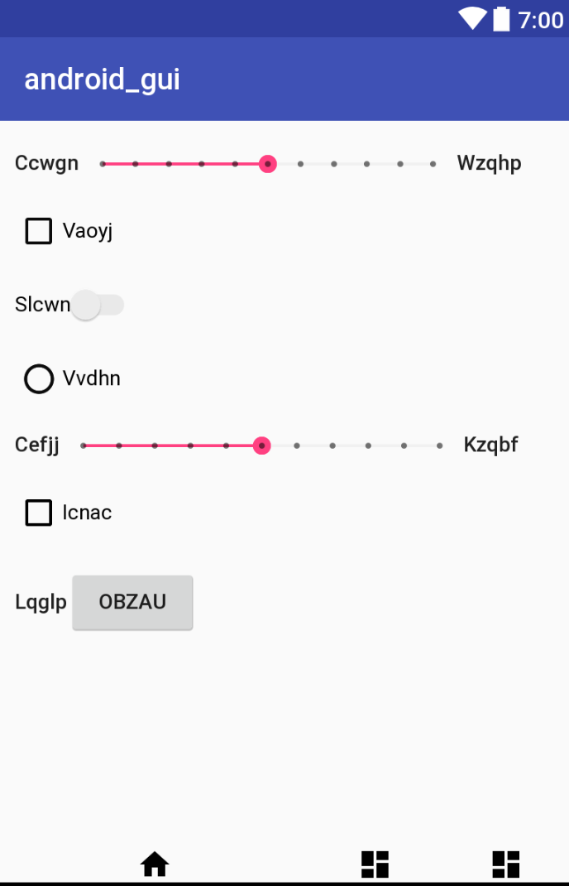
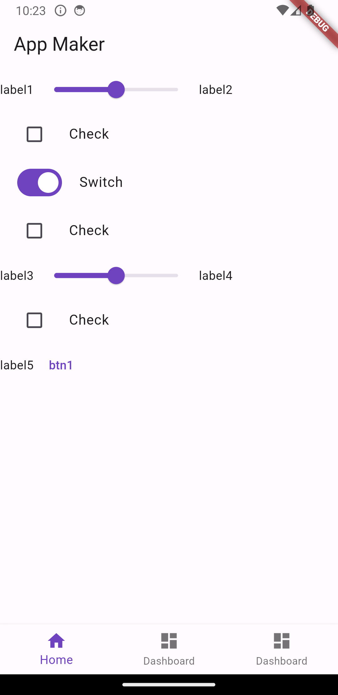

# pix2code-Flutter-page-maker
Using custom trained pix2code model, generate simple Flutter app page code using GUI image.

## Training Model
* pix2code model implementation from paper `https://arxiv.org/abs/1705.07962`.
* Trained the model on kaggle. The notebook is available in folder `training`.
* After training, the model download it and place it in the `outputs` folder.
* Dataset is available at `https://www.kaggle.com/datasets/vikramtiwari/pix2code`.

## Generating Flutter Code
* To generate Flutter code, run the following command in terminal.
```
python3 flutter_page_maker.py <input_image_path> <output_folder_path>
```
* Default output_folder_path is `generated_page_output`.
* Now you can copy and paste the generated code in your Flutter project.

## Example
* <b>Input Image</b> :  
  
* <b>Generated Code</b> :  
stack { row { label , slider , label } row { check } row { switch } row { check } row { label , slider , label } row { check } row { label , btn } } footer { btn-home , btn-dashboard , btn-dashboard }  
* <b>Generated Flutter Page</b> :   
  